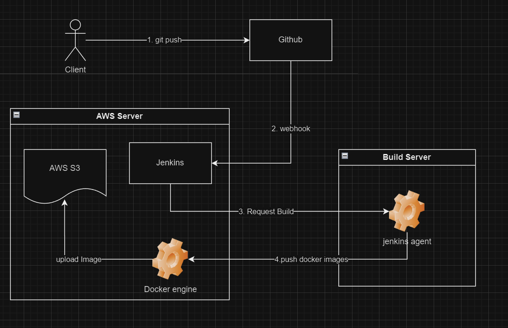
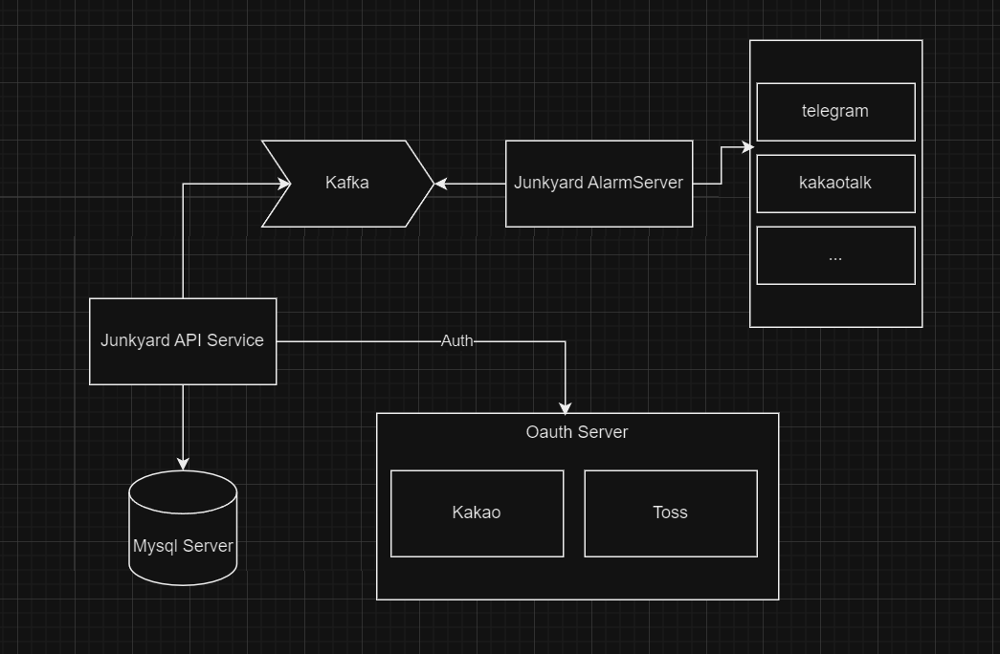

# 폐차장 예약 관리 Backend

## frontend github
https://github.com/leey0818/junkyard-reservation-app

## Spec
* spring boot 3 
* java 17
* jpa
* mysql
* restdocs

## CD / CI 구조

1. github push
2. webhook -> jenkins
3. jenkins Request Build to Jenkins Agent 
   * AWS CPU / 메모리 이슈
4. Build app Dockerize
5. image upload Aws S3

## 시스템 구조

 * 이후 Redis Pub/sub 활용한 실시간 채팅
 * 토스/카카오페이 결제 모듈을 추가 예정

### 카카오 로그인
https://github.com/kiomnd2/kakao-login-sample

## API 가이드
[REST API Docs](http://3.35.254.168:38080/docs/index.html)

##
